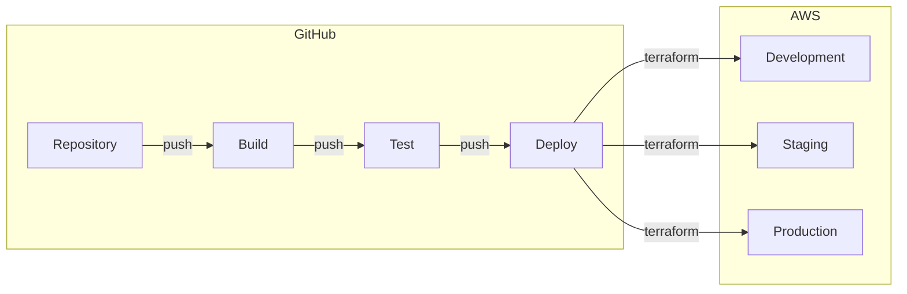

# cyhy-hackfest-2022-09 #

## Purpose ##

CyHy Hackfest 2022-09 to test CI/CD deployment of GraphQL APIs to AWS AppSync.

## Spiffy Diagram ##

The following diagram shows how this repository interacts with a development,
staging, and production environments.

## Contributing ##

~~We welcome contributions!~~
Here be dragons! Please see [`CONTRIBUTING.md`](CONTRIBUTING.md) for
details.

## License ##

This project is in the worldwide [public domain](LICENSE).

This project is in the public domain within the United States, and
copyright and related rights in the work worldwide are waived through
the [CC0 1.0 Universal public domain
dedication](https://creativecommons.org/publicdomain/zero/1.0/).

All contributions to this project will be released under the CC0
dedication. By submitting a pull request, you are agreeing to comply
with this waiver of copyright interest.
